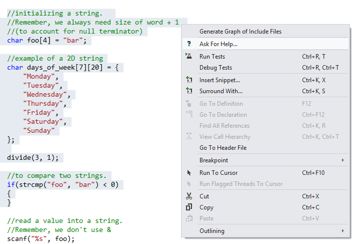
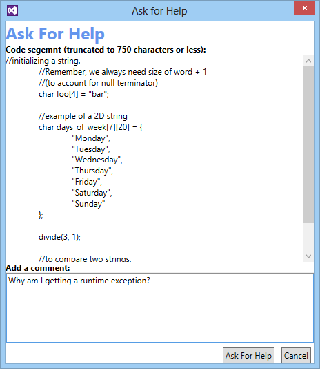

# Asking for Help
As an alternative to posting questions directly in the activity feed, you may also highlight a given code segment within Visual Studio and select "ask for help."  Note that you may only select up to 750 characters.

Pictured is below the "ask for help" window.  Below your selected code segment is an area for you to add your question.  When satisfied, click the "Ask For Help" button.  In a few moments, your question will appear in the activity stream.

