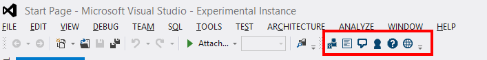

### External Links:
* [Activity feed](Activity-Feed)
* [User profile page](User-Profile)
* [Asking for help](Ask-for-Help)

# Basic OSBLE{"+"} VS Plugin Usage
When installed, the OSBLE{"+"} VS Plugin exposes the OSBLE{"+"} VS Plugin toolbar inside of Visual Studio.  On most systems, the OSBLE{"+"} VS Plugin toolbar will appear underneath the main menu options near the right-side of the screen:

If the OSBLE{"+"} VS Plugin toolbar did not automatically appear, it can be opened manually by right-clicking on empty space in the toolbar area and selecting "OSBLE{"+"} Toolbar."

From left to right, the toolbar actions are: log in, activity feed, profile, help, and web browser.

## Log in Action
Clicking the "log in" button brings up the same login window found underneath the "Tools" menu.  When you are logged into the OSBLE{"+"} VS Plugin, the background changes from inactive  to active (yellow background) .  As long as you are logged into OSBIDE, you have access to the other OSBIDE components.  

## Activity Feed Action
Information about the activity feed is on its own [Activity Feed](Activity-Feed) page.

## Profile Action
Information about user profiles is on its own [User Profile](User-Profile) page.

## Help Action
Clicking on the help button will bring up the [OSBLE+ VS Plugin documentation.](https://osble.codeplex.com/wikipage?title=VS%20Plugin)

## Web Browser Action
Some users may prefer to view the OSBLE{"+"} activity feed in a web browser as opposed to within Visual Studio.  To open the OSBLE{"+"} activity feed for the web, click the web browser icon.  This will launch OSBLE{"+"} in your default web browser.

## Other actions
In addition to the toolbar actions, the OSBLE{"+"} VS Plugin also exposes an [Ask for Help](Ask-for-Help) feature as well as an [Error Search](Error-Search) feature.

