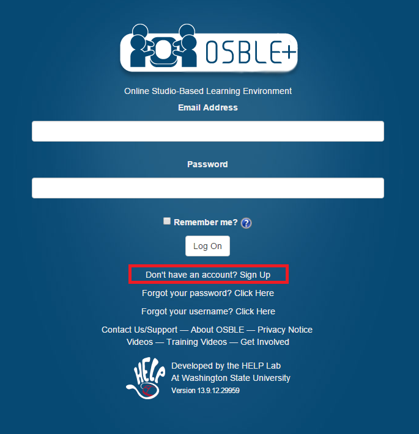
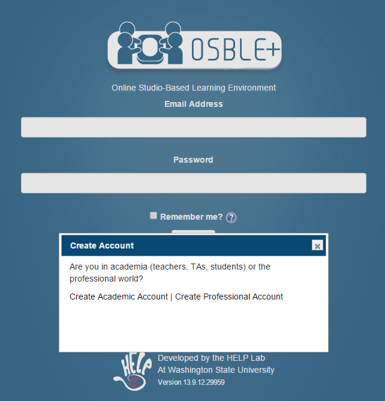
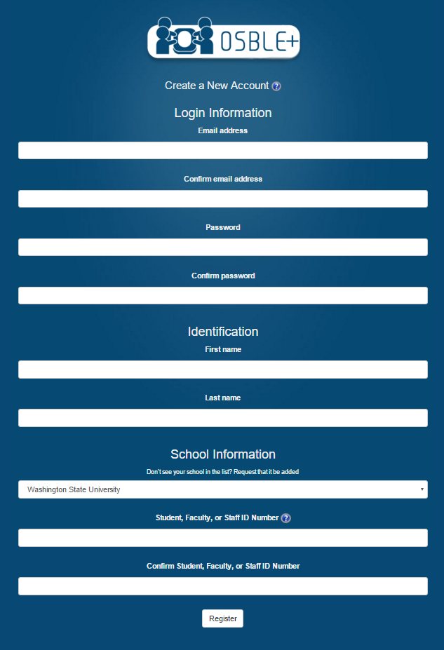
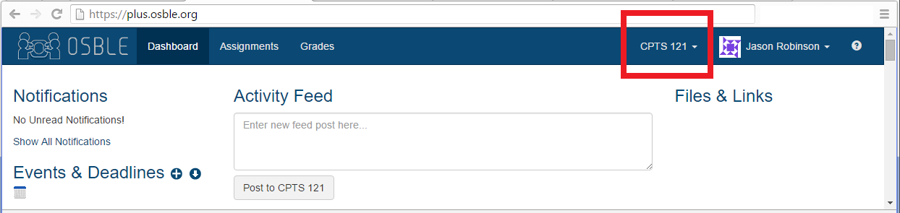
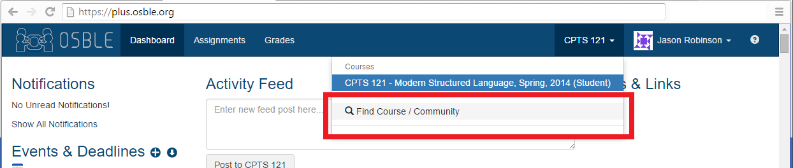
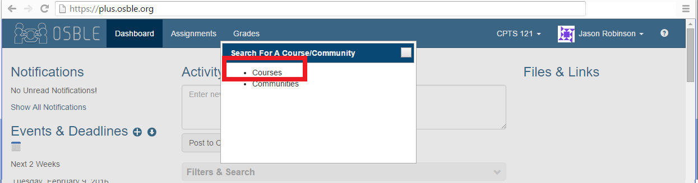
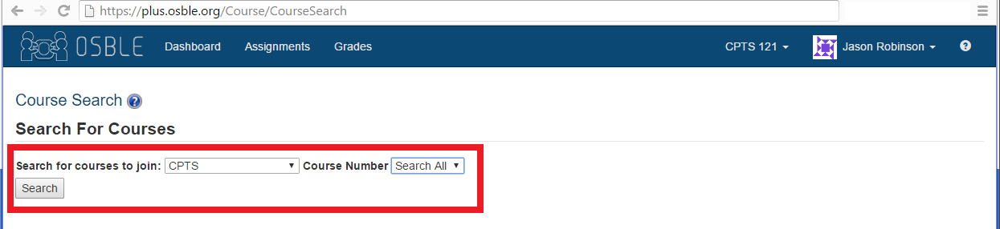
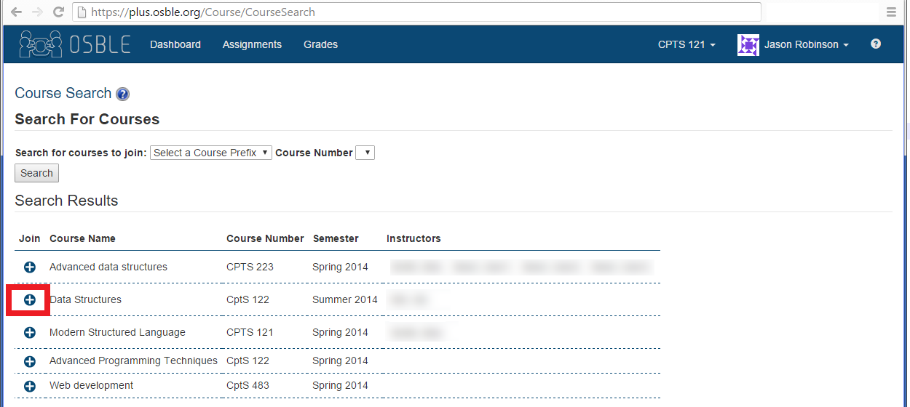
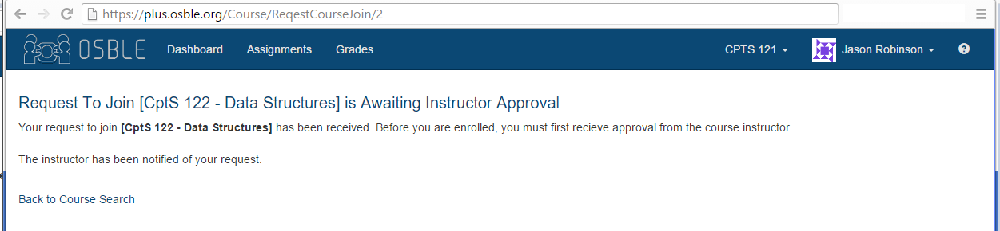

# Adding Courses in OSBLE+
In order to submit assignments using the OSBLE{"+"} Visual Studio Plugin, you must be registered for the relevant course.  To do so, you may visit the [OSBLE+ website](http://plus.osble.org) in your web browser or click the "View OSBLE{"+"} in your browser" icon in the toolbar menu  

If you do not have an OSBLE{"+"}  account you'll need to create an account first. Click "Sign Up" on the OSBLE{"+"}  home page.

Then choose "Create an Academic Account"

and finally, fill out the registration form and click "Register"

Once logged in, you can use the "Find Course/Community" link in the course dropdown next to your user icon/name in the upper right to search for and select the course in which you would like to join.

Choose "Courses"

Use the dropdowns to filter course name and number

After clicking the "Join" () button OSBLE{"+"} will inform you that your request to join the course has been sent to the instructor:

Having enrolled in a course, you are now allowed to [submit assignments](Submitting-an-Assignment) for that course.

