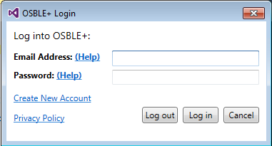
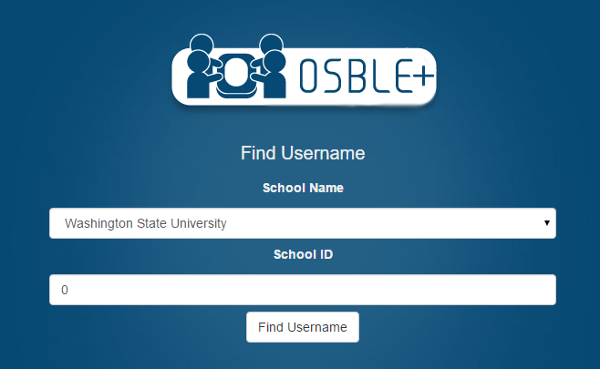

# Retrieving a Forgotten Email Address
If you've forgotten the email address that you used to register for OSBLE{"+"}, click the "help" link next to the "Email Address" label in the OSBLE{"+"} VS Plugin login window:

This will bring up a web link that allows you to find your email address.  To complete, simply select your university and enter your student ID number.  Clicking the "Find Username" will display your email address on the screen.

