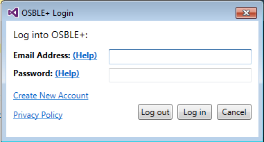

# Starting the OSBLE{"+"} VS plugin for the First Time
After installing the OSBLE{"+"} VS plugin and upon your next fresh launch of Visual Studio, you will be greeted with a welcome message asking you to log into the OSBLE{"+"} VS plugin.  

After clicking the OK button to acknowledge the dialog, Visual Studio will continue to load.  Note that sometimes the dialog gets hidden behind Visual Studio, which may cause it to appear as though Visual Studio has frozen.  If this is the case, use the task bar to bring the welcome dialog to the front of the screen.  

## Logging into the OSBLE{"+"} VS plugin
To log into the OSBLE{"+"} VS plugin, go to the TOOLS menu and select "Log into OSBLE{"+"}."  

This will open the OSBLE{"+"} VS plugin login dialog. 

If you have not yet created an account, you can do so by clicking the "Create New Account" link near the bottom-left of the login screen.  If you have forgotten either your email address or password, click the "Help" link next to the related field.  These steps are covered in another tutorial.  Having entered your email address and password, click the "Log in" button to proceed.  When the login process is complete, you will receive the following notification message:

From here, you may be interested in reading about [Basic OSBLE+ VS Plugin Usage](Basic-OSBLE+-VS-Plugin-Usage).

