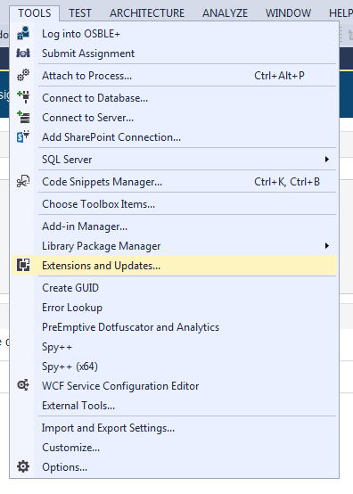
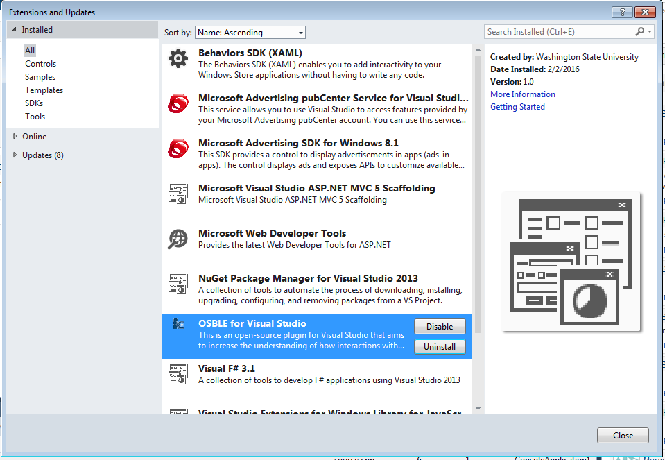
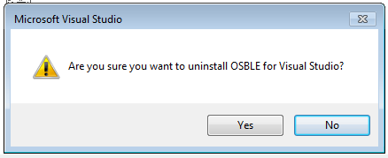
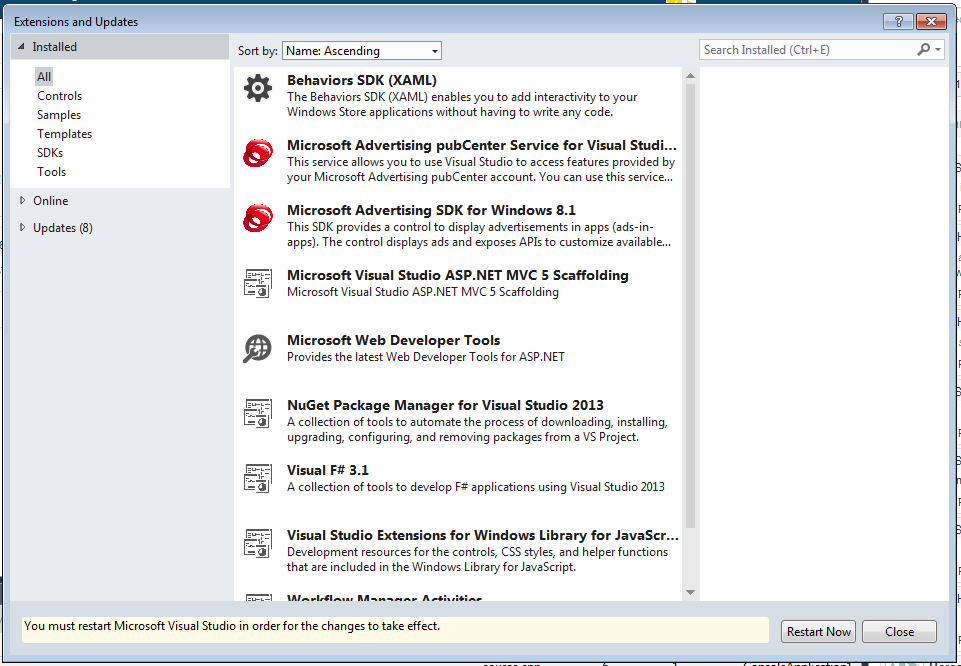

# Uninstalling the OSBLE{"+"} VS Plugin
Uninstalling the OSBLE{"+"} VS Plugin is a simple process that is handled by Visual Studio's extension manager.  To uninstall the OSBLE{"+"} VS Plugin, select the "Extensions and Updates…" option under the "Tools" menu.

Next, select the "OSBLE{"+"} VS Plugin" extension and click the "Uninstall" button.

Visual Studio will confirm that you would like to remove the extension.

After a brief period, Visual Studio will uninstall the OSBLE{"+"} VS Plugin and bring you back to the extension manager window.  Note that in order for the OSBLE{"+"} VS Plugin to be completely removed from your system, you'll need to restart all open instances of Visual Studio.

